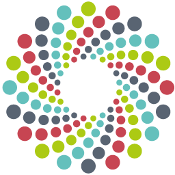

# bioimage-repositories

Comparison of platforms for sharing biological imaging data

**Source:** Adapted from [Beth Cimini’s comparison
table](https://zenodo.org/records/7628604)

## Contributing

1.  Edit [`data/repositories.yaml`](data/repositories.yaml) to add/modify repository information
2.  (Optional) Add repository logos to [`images/`](images/) folder with same name as YAML key
3.  Run `./scripts/update_table.sh` to regenerate the table
4.  Submit pull request with changes

<!-- AUTO-GENERATED TABLE START -->

*Auto-generated from [data/repositories.yaml](data/repositories.yaml)*

| Repository | URL | Best For | Qualifications | Size Limit | Cost | Metadata |
|------------|-----|----------|----------------|------------|------|----------|
| **Zenodo**  | [zenodo.org](https://zenodo.org) | All digital artifacts | Research outputs of any kind | 50 GB per collection (soft) | Free | None |
| **Figshare**  | [figshare.com](https://figshare.com) | Research data outputs | Research data outputs | 20 GB free, 5TB paid | Free-$585+ | Low |
| **Dryad**  | [datadryad.org](https://datadryad.org) | CC0 non-human data | Non-human identifiable data that authors are willing to make CC0 | 300 GB | $120+ | Low |
| **Bioimage Archive**  | [ebi.ac.uk/bioimage-archive](https://www.ebi.ac.uk/bioimage-archive) | Non-medical microscopy | Non-medical, non-Electron Microscopy images of any kind | No limit | Free | Medium |
| **IDR**  | [idr.openmicroscopy.org](https://idr.openmicroscopy.org) | Reference datasets | Reference image datasets - complete, can be associated with other resources, likely to be re-analyzed | 1 TB | Free | High |
| **EMPIAR**  | [ebi.ac.uk/pdbe/emdb/empiar](https://www.ebi.ac.uk/pdbe/emdb/empiar/) | Electron microscopy | Electron microscopy image data | Tens of TB | Free | High |
| **Cell Painting Gallery**  | [broad.io/CellPaintingGallery](https://broad.io/CellPaintingGallery) | Cell Painting datasets | Large-scale image sets using the Cell Painting assay or derivatives | No limit | Free | Medium |
| **SSBD**  | [ssbd.riken.jp/repository](https://ssbd.riken.jp/repository) | Quantitative biology | Bioimaging and biological quantitative datasets associated with studies | 16GB per file | Free | Medium |
| **BBBC**  | [broad.io/BBBC](https://broad.io/BBBC) | Benchmark datasets | Image sets with descriptions and ground truth | No limit | Free | Medium |

